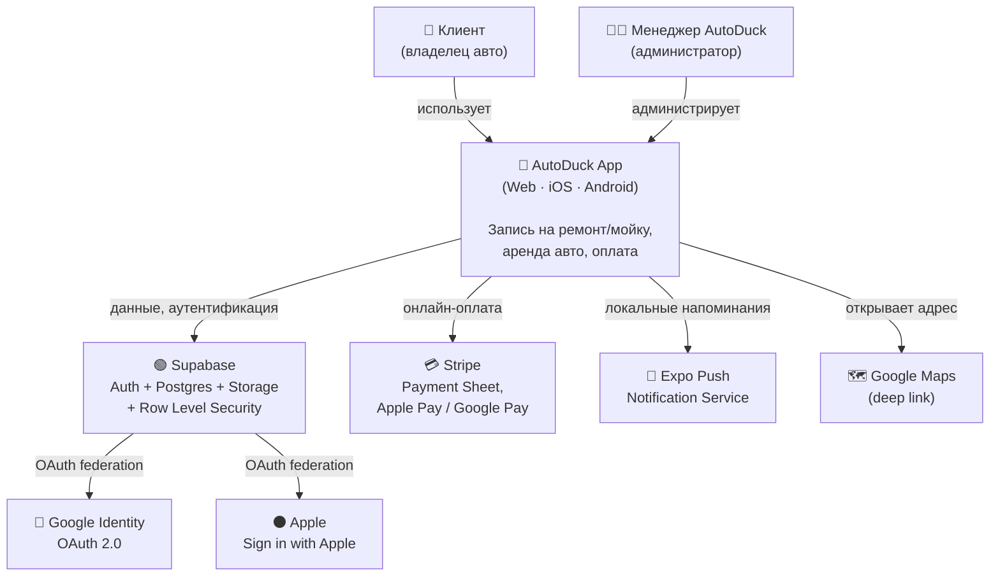
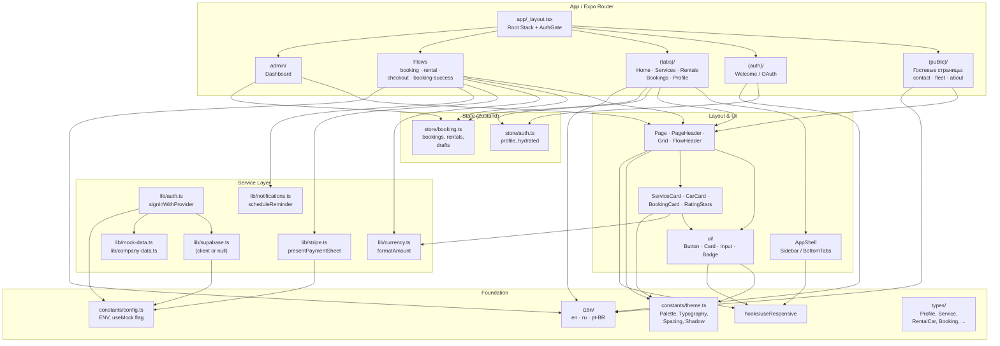
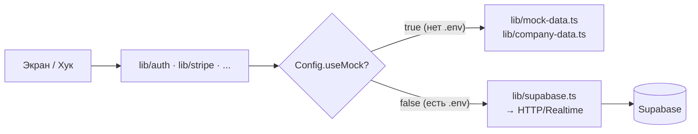

# Архитектура — CarService1 / AutoDuck

Описание системы в **C4 модели** Симона Брауна — три уровня детализации, от
взгляда «снаружи» (контекст) до взгляда «внутри одного контейнера»
(компоненты фронтенда).

> Диаграммы написаны в **Mermaid** — GitHub отрисует их прямо в README.
> Если ваш просмотрщик не поддерживает Mermaid, ниже каждой диаграммы есть
> текстовое пояснение.

---

## C1 — System Context

Система **AutoDuck App** в окружении пользователей и внешних сервисов.



**Что видно на диаграмме:**

- **Два типа пользователей.** Клиент бронирует, менеджер AutoDuck смотрит
  дашборд и управляет автопарком.
- **Один пользовательский продукт.** Web/iOS/Android — это одно приложение
  на единой кодовой базе (Expo + React Native).
- **Бэкенд — Supabase.** Не свой сервер, а managed-Postgres с Auth, Storage
  и встроенным RLS. OAuth-провайдеры (Google, Apple) подключаются к Supabase
  Auth, а не к приложению напрямую.
- **Платежи опциональны.** Stripe вызывается только если клиент выбирает
  «Оплатить сейчас»; путь «Оплата в офисе» к Stripe не обращается.
- **Карты — deep link.** Своего гео-сервиса нет; экран контактов открывает
  Google Maps по адресу.

---

## C2 — Container

Внутри коробки **AutoDuck App** — что это за «контейнеры» в C4-смысле,
и как они общаются с внешним миром.

```mermaid
graph TB
    subgraph "Клиентские контейнеры"
        Web["🌐 Web App<br/>React Native Web<br/>(браузер)"]
        Mobile["📱 Mobile App<br/>iOS / Android<br/>(Expo Go или нативная сборка)"]
    end

    subgraph "Supabase (managed)"
        Auth["🔐 Supabase Auth<br/>JWT + OAuth"]
        DB["🗄️ Postgres + RLS<br/>profiles, services,<br/>rental_cars, bookings,<br/>rentals, payments, reviews"]
        Storage["📁 Storage<br/>public-images bucket<br/>(фото услуг и авто)"]
        EdgeFn["⚙️ Edge Functions<br/>(roadmap: create-payment-intent)"]
    end

    StripeAPI["💳 Stripe API"]

    Web -->|"@supabase/supabase-js<br/>HTTPS / JWT"| Auth
    Web -->|REST / Realtime| DB
    Web -->|публичные URL| Storage
    Mobile -->|"@supabase/supabase-js"| Auth
    Mobile -->|REST / Realtime| DB
    Mobile -->|публичные URL| Storage

    Web -.->|payment intent<br/>(roadmap)| EdgeFn
    Mobile -.->|payment intent<br/>(roadmap)| EdgeFn
    EdgeFn -.->|server-side| StripeAPI

    Web -->|"@stripe/stripe-react-native"<br/>(client SDK)| StripeAPI
    Mobile -->|"@stripe/stripe-react-native"| StripeAPI
```

**Контейнеры и стек:**

| Контейнер | Технология | Деплой |
|-----------|-----------|--------|
| Web App | React Native Web + Expo Router (export web) | Vercel / Netlify (статика) |
| Mobile App | React Native + Expo SDK 54 | Expo Go (dev), EAS Build → App Store / Google Play (prod) |
| Supabase Auth | Supabase managed | supabase.com |
| Postgres + RLS | Supabase Postgres | supabase.com |
| Storage | Supabase Storage | supabase.com |
| Edge Functions | Deno runtime (Supabase) | supabase.com — *в roadmap* |
| Stripe API | Stripe.com | внешний SaaS |

**Поток данных:**

- Клиент → Supabase: запросы идут с JWT-токеном; **Row Level Security**
  отсекает чужие данные на уровне базы — на клиент попадает только то, что
  клиент имеет право видеть.
- Клиент → Stripe (текущее MVP): SDK работает напрямую с публичным ключом,
  payment intent эмулируется (mock-режим).
- Клиент → Stripe через Edge Function (roadmap): production-вариант, где
  intent создаётся на сервере с secret-ключом.

---

## C3 — Component (Frontend)

Что внутри Web/Mobile-контейнера — функциональные модули и их связи.



**Модули и их роли:**

| Слой | Что делает | Ключевые файлы |
|------|-----------|----------------|
| **App / Router** | Маршрутизация + AuthGate (редиректы по сессии) | `app/_layout.tsx`, группы `(public)`, `(auth)`, `(tabs)` |
| **Layout & UI** | Адаптивный shell, layout-примитивы, базовые UI-компоненты, доменные карточки | `components/AppShell.tsx`, `components/layout/*`, `components/ui/*`, `components/{Service,Car,Booking}Card.tsx` |
| **State** | Zustand-сторы для сессии и записей; черновики bookingDraft / rentalDraft | `store/auth.ts`, `store/booking.ts` |
| **Service Layer** | Тонкая обёртка над Supabase, Stripe, push, форматированием. Поддерживает mock-режим без бэкенда | `lib/*.ts` |
| **Foundation** | Дизайн-токены, ENV/конфиг, i18n, типы, адаптивные хуки | `constants/`, `i18n/`, `types/`, `hooks/` |

**Правила границ:**

- Экраны зависят от `lib/*` и `store/*`, **никогда не наоборот**.
- `lib/*` зависит только от `constants/config.ts` и типов.
- Компоненты не импортируют экраны.
- Все цвета — через `Palette`, все строки — через `t()`, всё это закреплено
  в [`CLAUDE.md`](../CLAUDE.md).

---

## Mock-режим vs Live-режим

Один из ключевых архитектурных приёмов проекта — **переключаемый источник
данных**. Без `.env` или с `EXPO_PUBLIC_USE_MOCK=true` все сервисы возвращают
демоданные; при заполненных ключах Supabase автоматически активируется live.



Это даёт две важные вещи: приложение работает «из коробки» сразу после
`git clone && npm install`, и команды разработки и контента могут двигаться
параллельно.

---

## Ссылки

- [Spec — все экраны и контракты](SPECIFICATION.md)
- [Content guide — как менять контент](CONTENT.md)
- [Supabase setup](../supabase/README.md)
- C4 model: https://c4model.com
- Mermaid: https://mermaid.js.org
